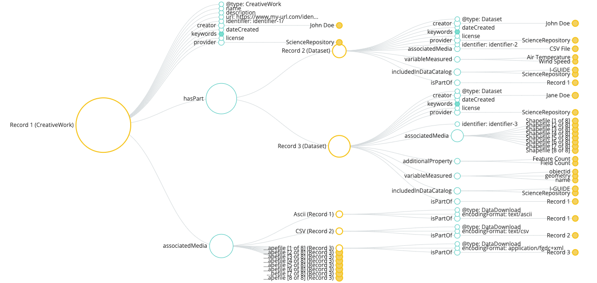

# I-GUIDE Catalog Schema Design

The I-GUIDE catalog uses Schema.org vocabulary to store metadata about diverse resource (record)
types, including the examples listed below. These examples are expressed as
`json+ld` format as a standardized and readable way to capture metadata, leveraging
Schema.org classes (also often called Types), Schema.org DataTypes, and Schema.org properties whenever possible.

## Purpose of the Catalog

Provide efficient discoverablity and access.

## Definitions

- `Record` : is a representation of 'metadata+data' necessary to describe scientific work. `Records` can be grouped together and/or nested to represent complex relationships between scientific data, e.g. GIS files, timeseries, research studies, collections of data, etc.
  
- `Schema`: is the metadata strucure used to describe 'metadata+data' using the Schema.org vocabulary. A schema is composed of a Schema.Org Types, each of which is associated with a set of Schema.org Properties and DataTypes.

- Schema.org ${\color{salmon}Type}$ (also called class) - a specific vocabulary that applies to a specific piece of data.

- Schema.org ${\color{peru}Property}$ - the subject matter of the content.

- Schema.org ${\color{darkgray}DataType}$ - the basic data types such as Integers, Strings, etc.

## What is a Record?

**Figure 1**: *An example of a record described using CreativeWork and Dataset
Schemas ([code example](record-example-schema.json)).*

A record is a representation of metadata and data files using the Schema.Org vocabulary. Records must be described by Schema.Org CreativeWork (or subtypes of CreativeWork), and may consist of scientific data such as datasets, software code, a landing page to a trusted repository, etc. 

Every I-GUIDE catalog record consists of 'metadata+data' described using one or more schema definitions. Each
schema definition contains a set of properties. All
catalog records must be described using the **Core schema** defintion outlined below. The Core schema properties are
inherited from two Schema.org Types (classes): *Thing* and *CreativeWork*. There are
many properties that belong to these types and all of them may be used. Since
many of these properties are not relevant to the I-GUIDE catalog, we've
identified the required and optional properties in the [Core Schema](core.md) document. 

Depending on the type of scientific work that is being described, subclasses of the CreativeWork schema may be desirable.
For example, the Dataset Type contains additional properties that
are useful when describing scientific datasets, e.g. earth observation data. We provide an overview of
required and recommended properties for several CreativeWork subclasses that are relevant to
the I-GUIDE catalog. Moreover, we provide examples of several common records
that use these schemas.

The following documents describe the schemas that can be used to create I-GUIDE catalog records:

- [Core](core.md)
  - [Dataset](dataset.md)
  - in progress - [SoftwareSourceCode](sourcecode.md)
  - in progress - [SoftwareApplication](softwareapp.md)

